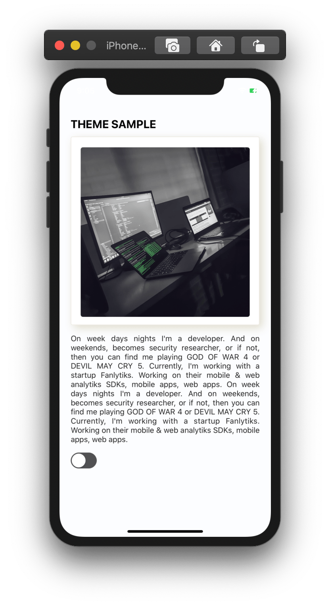
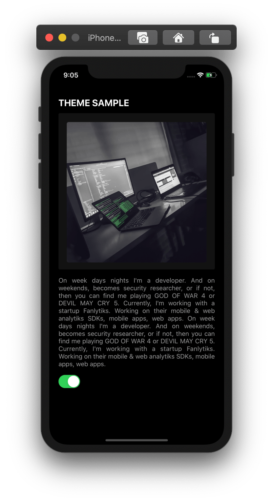

# React-Native-Dark-Theme

## Getting Started

`$ yarn install`

### before running apps on iOS

`$ cd ios && pod install`

`$ cd ..`

### Running your React Native application

- android

`$ npx react-native run-android`

- iOS

`$ npx react-native run-ios`

### Change default iOS Simulator

on root directory

`$ xcrun simctl list devices`

`$ npx react-native run-ios --simulator="iPhone 11"`

